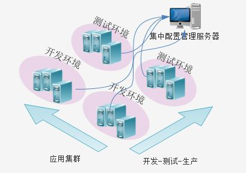

# 7天学会Spring Cloud

[7天学会spring cloud](http://git.oschina.net/zhou666/spring-cloud-7simple)

## [使用Spring Boot创建一个应用](http://www.cnblogs.com/skyblog/p/5127712.html)

Spring Boot可以看做是在Spring基础上再包了一层，这一层包含方便开发者进行配置管理和快速开发的模块，以及提供了一些开箱即用的工具，比如监控等。

[Spring Boot官方文档中文翻译版](https://github.com/qibaoguang/Spring-Boot-Reference-Guide)

pom.xml

```xml
<project xmlns="http://maven.apache.org/POM/4.0.0" xmlns:xsi="http://www.w3.org/2001/XMLSchema-instance"
	xsi:schemaLocation="http://maven.apache.org/POM/4.0.0 http://maven.apache.org/xsd/maven-4.0.0.xsd">
	<modelVersion>4.0.0</modelVersion>

	<parent>
		<groupId>org.springframework.boot</groupId>
		<artifactId>spring-boot-starter-parent</artifactId>
		<version>1.5.3.RELEASE</version>
	</parent>

	<groupId>springcloud</groupId>
	<artifactId>helloworld</artifactId>
	<version>0.0.1-SNAPSHOT</version>
	<packaging>jar</packaging>

	<name>helloworld</name>
	<url>http://maven.apache.org</url>

	<properties>
		<project.build.sourceEncoding>UTF-8</project.build.sourceEncoding>
	</properties>

	<dependencies>
		<dependency>
			<groupId>org.springframework.boot</groupId>
			<artifactId>spring-boot-starter-web</artifactId>
		</dependency>
	</dependencies>

	<build>
		<plugins>
			<plugin>
				<groupId>org.springframework.boot</groupId>
				<artifactId>spring-boot-maven-plugin</artifactId>
			</plugin>
		</plugins>
	</build>
</project>
```

在pom配置中，我们仅仅使用了spring-boot-starter-web依赖，spring boot会根据此依赖下载相关jar包并初始化基本的运行环境，比如说绑定端口8080等。spring boot封装所有配置信息为键值类型，如果想改变默认设置，只需要想应用中传入这个键值对就可以。

比如，想改变绑定端口为8081，那么可以在main方法里传入"--server.port=8081"，或者干脆使用：SpringApplication.run(HelloWorld.class,"--server.port=8081");

HelloWorld.java

```java
package springcloud.helloworld;

import org.springframework.boot.SpringApplication;
import org.springframework.boot.autoconfigure.SpringBootApplication;
import org.springframework.stereotype.Controller;
import org.springframework.web.bind.annotation.RequestMapping;
import org.springframework.web.bind.annotation.ResponseBody;

@Controller
@SpringBootApplication
public class HelloWorld {


	@RequestMapping(value = "/")
	@ResponseBody
	public String hello() {
		return "Hello World!";
	}
	
	public static void main(String[] args) throws Exception{
		SpringApplication.run(HelloWorld.class, args);
	}

}
```

@SpringBootApplication相当于@Configuration、@EnableAutoConfigurateion和@ComponentScan，你也可以同时使用这三个注解，其中@Configuration、@ComponentScan是Spring框架的语法，用于代码方式创建配置信息和扫描包。

### 部署Spring Boot应用

要部署运行Spring Boot应用，首选要打包Spring Boot应用，在pom文件中看到的spring-boot-maven-plugin插件就是打包spring boot应用的。

执行`mvn package`，打包过后就可以进入target目录使用java原生命令来执行这个应用。

>java -jar helloworld-0.0.1-SNAPSHOT.jar --server.port=8081

这样就可以看到一个基于jar包的web应用启动了。

### 开启监控

在pom文件中引入

```xml
		<dependency>
			<groupId>org.springframework.boot</groupId>
			<artifactId>spring-boot-starter-actuator</artifactId>
		</dependency>
```

引入之后，spring boot是默认开启监控的，运行应用后输入链接：

http://localhost:8080/health

就可以看到默认的监控信息：

>{"status":"UP","diskSpace":{"status":"UP","total":121206992896,"free":36960731136,"threshold":10485760}}


## [使用Spring Cloud实现分布式配置管理](http://www.cnblogs.com/skyblog/p/5129603.html)

分布式配置管理应该是分布式系统和微服务应用的第一步。想象一下如果你有几十个服务或应用需要配置，而且每个服务还分为开发、测试、生产等不同维度的配置，那工作量是相当大的，而且还容易出错。如果把各个应用的配置信息集中管理起来，使用一套机制或系统来管理，那么将极大的提高系统开发的生产效率，同时会提高系统开发环境和生产环境运行的一致性。



在传统开发中，我们往往需要自己开发“配置管理服务器”，你可以使用redis、idap、zookeeper、db等来存放统一配置信息，然后开发一个管理界面来进行管理。传统的做法没什么问题，和spring cloud所提供的配置管理房啊相比，就是前者需要自己开发，而后者直接简单使用现成的组件即可。当然还有很重要的一点，spring配置管理模块由于是spring boot核心来实现的，所以做了大量的工作，可以把一些启动参数进行配置，这在传统的方案中很难办到，因为涉及到要改写第三方组件的问题，难度很大。比如web应用的绑定端口，传统应用只能在tomcat配置文件里改，而spring cloud可以放到远程，类似还有数据库连接，安全框架配置等。

 